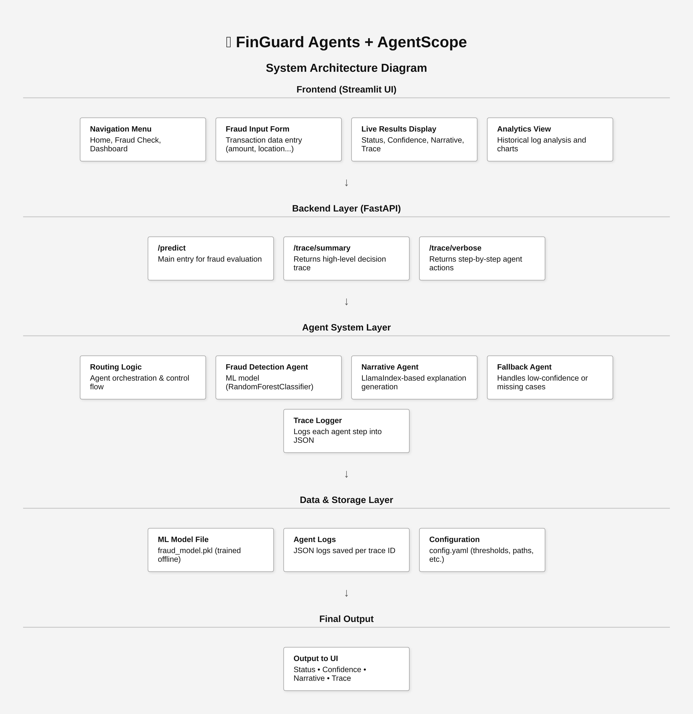

# AgentScope - AI Agent Traceability and Reliability Framework

AgentScope runs AI agents with full traceability, confidence scoring, and plain-language explanations. It started as a fraud detection prototype, but the design works for any domain where you need to see exactly how an AI made its decision.

## Live Demo

Frontend (Streamlit UI)  
https://katreddidurga-agentscope-finguard-appuiui-rlc8of.streamlit.app/

Backend API (FastAPI)  
https://fingard-agents-api.onrender.com

The Streamlit app talks directly to the Render-hosted API. You can submit transactions, see the AI decision, and inspect the trace for any request.

---

## Screenshots

**1. Home Page**  
`images/home_form.png` – Shows the transaction input form with sample data filled in.

**2. Fraud Check Form with Live Results View**  
`images/results_view.png` – Displays decision status, confidence score, and narrative after submitting a transaction.

**3. Debugger - Trace Summary**  
`images/trace_summary.png` – High-level overview of the decision process, including policy flags and agent steps.

**4. Debugger - Verbose Trace**  
`images/trace_verbose.png` – Step-by-step breakdown of every agent action, including inputs, outputs, and timings.

**5. System Architecture Diagram**  
`images/architecture_diagram.png` – Visual diagram of the frontend, backend, agents, and data layers.

---

## What you can do in the UI

- Enter transaction details like amount, location, and merchant.
- Get an instant fraud/legit decision with a confidence score.
- Read a short explanation of why the decision was made.
- Open a debugger view to see every step the agents took.
- Explore past decisions by trace ID.

---

## How it works

When you submit a transaction, the system:
1. Assigns a unique trace ID for this run.
2. Routes the request to the Fraud Detection Agent.
3. Runs a Policy Evaluator to apply thresholds and rules.
4. If the result is low-confidence or missing data, calls the Fallback Agent.
5. Generates a grounded explanation with the Narrative Agent.
6. Logs every step in structured JSON under the same trace ID.

---

## Agents

**Fraud Detection Agent**  
RandomForestClassifier trained on transaction data. Returns label and probabilities.

**Policy Evaluator**  
Applies business rules from `config.yaml` to decide if the result should stand, be retried, or sent for manual review.

**Fallback Agent**  
Handles low-confidence results or missing information. Can return a safe default or escalate.

**Narrative Agent**  
Uses retrieval-augmented generation grounded in the trace to produce a clear, factual explanation.

**Trace Logger**  
Writes every agent action, input, output, and timing to JSON logs for review and audit.

---

## Adapting to other domains

Replace the Fraud Detection Agent with any other domain-specific agent. The rest of the framework stays the same, giving you traceability, fallback handling, and grounded narratives out of the box.

---

## Tech stack

- Frontend: Streamlit (hosted on Streamlit Cloud)
- Backend: FastAPI (hosted on Render)
- Model: RandomForestClassifier (scikit-learn)
- Narrative: LlamaIndex RAG with grounding from the trace
- Storage: JSON logs (upgrade path to Postgres, MongoDB, or Kafka)

---

## License

MIT License
